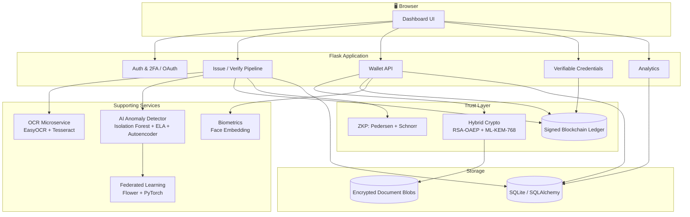

<div align="center">

# 🔐 DocuVault

### Blockchain-Backed Document Issuance, Verification & Digital Identity Wallet

*Tamper-evident certificates. Post-quantum-secured storage. Real zero-knowledge proofs. AI-powered forgery detection.*

[](LICENSE)
[](https://www.python.org/)
[](https://flask.palletsprojects.com/)
[](#-testing)

[Overview](#-overview) • [Features](#-key-features) • [Architecture](#-architecture) • [Getting Started](#-getting-started) • [API](#-api-reference) • [Security](#-security-model)

</div>

---

## 📖 Overview

**DocuVault** is a full-stack platform that lets institutions issue digital
certificates that can never be silently forged or altered, and gives the
people those certificates belong to a personal, encrypted, self-sovereign
wallet to hold and selectively share them — without ever handing over more
information than a verifier actually needs.

In plain terms: a school uploads a marksheet once. From that moment on,
anyone can check whether a copy of that marksheet is genuine in seconds,
without calling the school. The document's owner can share access to a
verified copy with an employer for exactly 30 days and then have it
automatically expire. They can even prove "I hold a valid degree from this
university" to a third party without showing the document, or any of the
personal details on it, at all.

Under the hood, DocuVault combines a signed, tamper-evident blockchain
ledger; hybrid classical + post-quantum encryption; genuine zero-knowledge
proofs; OCR-driven document reading; a multi-signal AI forgery detector;
and an opt-in biometric identity check — all wired together into one
coherent Flask application.

---

## ✨ Key Features

### 📄 Issuance & Verification
- Institutions upload a certificate; DocuVault OCR-reads it (EasyOCR +
  Tesseract fallback), extracts structured fields, and computes a
  canonical SHA-256 fingerprint.
- That fingerprint is permanently, signature-backed registered on the
  blockchain ledger.
- Anyone can re-upload the same document later to verify it against the
  ledger in seconds — any content change produces a completely different
  fingerprint and fails verification instantly.
- **Scan-to-verify QR codes** are generated at issuance for fast, phone-camera verification without a manual upload.

### 🔒 Digital Wallet & Selective Sharing
- Every citizen/verifier account gets a personal encrypted wallet, secured
  with an RSA-2048 + ML-KEM-768 **hybrid** keypair (see [Security
  Model](#-security-model)).
- Documents are stored using envelope encryption: a random AES-256-GCM key
  encrypts the file, and that key is itself protected by both a classical
  and a post-quantum wrap — compromising one alone is not enough.
- Owners grant time-limited access to specific verifiers and can revoke
  access instantly. Every grant and revoke is its own signed blockchain
  event, producing a permanent, tamper-evident audit trail per document.

### 🕵️ AI-Powered Forgery Detection
- **Isolation Forest** models score both the document image and its OCR
  text for statistical anomalies relative to genuine samples.
- **Error Level Analysis (ELA)** highlights JPEG regions with inconsistent
  compression history — a classic signature of image splicing/editing.
- A **convolutional autoencoder** flags documents that reconstruct poorly
  against a model trained only on genuine certificates.
- All three signals are combined into one consensus verdict shown
  alongside every verification result.

### 🧠 Federated Learning
- The anomaly-detection autoencoder can be retrained across simulated (or
  real, multi-institution) data shards using the **Flower** federated
  learning framework — no institution's raw documents ever leave its own
  environment.
- Retraining can be triggered on demand from the admin panel or runs
  automatically on a scheduled interval (systemd timer), with the improved
  model hot-reloaded into the live app with zero downtime.

### 🔐 Real Zero-Knowledge Proofs
- Citizens can prove a claim about a document they own — e.g. "I hold a
  genuine, registered certificate from this institution" — using a
  **Pedersen commitment + Fiat-Shamir Schnorr proof** over the BN128
  elliptic curve.
- The verifier learns only that the proof is valid — never the document's
  hash, its contents, or any personal field. This is a genuine
  zero-knowledge property, not a hash-comparison shortcut.

### 🧬 Post-Quantum Cryptography
- Document encryption keys are protected by a **hybrid** scheme combining
  RSA-OAEP with **ML-KEM-768 (Kyber)** via `liboqs`, so storage remains
  secure even against a future large-scale quantum computer, without
  dropping the well-understood guarantees of classical RSA in the
  meantime.

### 🧾 Verifiable Credentials
- Institutions can issue a portable, W3C-VC-shaped JSON credential
  alongside the standard blockchain registration, signed with the
  institution's Ed25519 key, verifiable completely offline by anyone
  holding the credential file — no network call required.

### 🖼️ Watermarking
- Certificates can carry an invisible, steganographically embedded digest
  of their own blockchain hash, giving verification a second, independent
  signal beyond the visible content.

### 🪪 Opt-In Biometric Verification
- Citizens may optionally enroll a face embedding (never the raw photo) to
  let a verifier confirm, at their discretion and with the citizen's prior
  consent, that the person presenting a document matches its rightful
  owner.

### 📊 Admin Analytics
- A live dashboard of issuance/verification volume, anomaly-flag rates per
  institution, and ledger health, backed by structured event logging on
  every request.

### 🛡️ Hardened by Design
- Two-factor authentication (TOTP) and Google OAuth on every account, CSRF
  protection on every state-changing request, rate-limited login/2FA/wallet
  endpoints with lockout, magic-byte upload validation, and zero hardcoded
  credentials or bypass codes anywhere in the codebase.

---

## 🏗️ Architecture



### Component summary

| Component | Technology | Responsibility |
|---|---|---|
| Web application | Flask, Flask-Login, Flask-WTF, Flask-Limiter | Serves the dashboard; handles auth, 2FA, OAuth, CSRF, and rate limiting; exposes all API endpoints. |
| Relational database | SQLite via SQLAlchemy (Alembic-migrated) | User accounts, document metadata, access grants, wallet keys, analytics events. |
| Blockchain ledger | Custom Python implementation, Ed25519-signed, JSON-persisted | Append-only, hash-linked, digitally-signed record of every issuance, grant, revoke, and ZKP commitment. |
| OCR microservice | Standalone Flask process, EasyOCR / Tesseract | Reads certificate text and extracts structured fields via prioritized regex. |
| Cryptography layer | `cryptography`, `liboqs-python`, `ecdsa` | AES-256-GCM document encryption; hybrid RSA-OAEP + ML-KEM-768 key wrapping; Ed25519 block signing. |
| Zero-knowledge layer | `py_ecc` (BN128 curve) | Pedersen commitments and Fiat-Shamir Schnorr proofs for selective-disclosure claims. |
| AI anomaly detection | scikit-learn, OpenCV, PyTorch | Multi-signal forgery detection combining classical ML and a trained autoencoder. |
| Federated learning | Flower (`flwr`), PyTorch | Cross-institution model improvement without centralizing raw documents. |
| Biometrics | `face_recognition` | Opt-in face-embedding identity verification. |

---

## 👥 Roles & Permissions

DocuVault operates with **three practical permission tiers**. (Two role
labels — `verifier` and `citizen` — exist for separate sign-up flows but
carry identical permissions everywhere in the code.)

| Role | Represents | Capabilities |
|---|---|---|
| **Admin** | System owner/operator | Full access: manage all accounts, view analytics, trigger federated retraining, review the signed ledger, everything below. |
| **Institution** | Schools, universities, government offices | Issue documents (OCR → hash → sign → register on ledger); optionally issue a companion Verifiable Credential; view their own issuance history. |
| **Verifier** *(includes Citizen)* | Anyone checking a document, and the document's own owner | Verify any document (hash + AI + QR + watermark check); maintain a personal encrypted wallet; receive, share, and revoke access to owned documents; generate zero-knowledge claim proofs; opt in to biometric enrollment; view a full audit trail of their own documents. |

Every account — local or Google OAuth — is protected by mandatory
two-factor authentication (TOTP).

---

## ⚙️ How It Works

### 1. Issuing a document

1. An Institution uploads a file. It's validated (real file-type sniffing,
   size and dimension caps) before anything else happens.
2. The OCR microservice extracts text and a fixed set of structured fields
   (name, roll number, dates, degree, board, grades, etc.), normalizing
   every value.
3. The normalized fields are hashed (SHA-256) into a single canonical
   `cert_hash`.
4. The AI anomaly layer scores the image and text independently.
5. A Pedersen commitment to the hash is generated for future zero-knowledge
   claims.
6. A new block — containing the hash, the commitment, the extracted
   fields, and the institution's identity — is signed with the
   institution's Ed25519 key and appended to the ledger.
7. A QR code and, optionally, a signed Verifiable Credential JSON file are
   generated for the institution to hand to the recipient.

### 2. Verifying a document

1. The same OCR → normalize → hash pipeline runs on the presented
   document (uploaded file, scanned QR, or pasted VC JSON).
2. The resulting hash is looked up on the ledger. Any mismatch — even a
   single altered character — means no matching block exists, and the
   document is reported unverified.
3. If a block is found, its signature is checked against the recording
   institution's public key, confirming the block itself hasn't been
   forged or tampered with.
4. The AI anomaly layer runs independently, catching visual or
   statistical tampering that a hash check alone wouldn't reveal.
5. If a watermark is present, it's checked as an additional signal.
6. The verifier sees a clear verdict plus every extracted field.

### 3. The wallet: receive, share, revoke

1. On registration, every account is provisioned with an RSA-2048
   keypair **and** an ML-KEM-768 keypair; private keys are stored only in
   encrypted form (PBKDF2-derived key from the account password, AES-GCM).
2. A document issued into a wallet is encrypted with a random AES key,
   which is itself wrapped by both the owner's RSA and ML-KEM public keys
   (hybrid envelope encryption).
3. To share, the owner unwraps the AES key with their own private keys and
   re-wraps it for the grantee's public keys, along with an expiry
   timestamp — recorded as a signed grant event on the ledger.
4. To revoke, a signed revoke event is written to the ledger and checked
   on every future access attempt — access stops immediately.
5. The complete, ordered history of every issuance/grant/revoke for a
   document is available to its owner as a permanent audit trail.

### 4. Proving a claim without revealing the document

1. The owner retrieves their document's stored (encrypted) blinding
   factor and generates a Schnorr proof over the document's Pedersen
   commitment.
2. Only the commitment and the proof — never the hash, never any field —
   are sent to the verifier.
3. The verifier checks the proof against the commitment recorded on the
   ledger and learns only "this claim is valid," nothing more.

### 5. Federated retraining

1. An admin triggers a retraining round (or it runs on its scheduled
   interval).
2. Each participating shard trains a local copy of the anomaly-detection
   autoencoder; only model weight updates — never raw documents — are
   aggregated (FedAvg) via Flower into an improved global model.
3. The new model is automatically converted to the format the live
   anomaly detector expects and hot-reloaded — no restart, no downtime.

---

## 🧰 Tech Stack

| Layer | Technologies |
|---|---|
| Backend framework | Flask, Flask-SQLAlchemy, Flask-Login, Flask-WTF, Flask-Limiter, Authlib |
| Database | SQLite (SQLAlchemy ORM, Alembic migrations) |
| Cryptography | `cryptography` (AES-GCM, RSA-OAEP, PBKDF2), `liboqs-python` (ML-KEM-768), `ecdsa`/Ed25519, `py_ecc` (BN128) |
| OCR | EasyOCR, Tesseract (`pytesseract`), OpenCV, Pillow, `pdf2image`, PyMuPDF |
| Machine learning | scikit-learn (Isolation Forest, TF-IDF), PyTorch (autoencoder), Flower (`flwr`) |
| Biometrics | `face_recognition` |
| Auth | `pyotp` (TOTP 2FA), Google OAuth 2.0 |
| Frontend | Server-rendered templates, vanilla JS, Chart.js (analytics) |
| Deployment | Gunicorn, Nginx reverse proxy, systemd (app + FL server + retraining timer) |
| Testing | pytest, pytest-flask, pytest-cov, `pip-audit` |

---

## 📁 Project Structure

```
DocuVault/
├── app/
│   ├── __init__.py              # App factory, config, blueprint registration
│   ├── database.py               # SQLAlchemy models (User, Document, WalletKey,
│   │                              #   AccessGrant, VerifiableCredential, AnalyticsLog, ...)
│   ├── auth.py                   # Login, 2FA, Google OAuth, institution key provisioning
│   ├── main.py                   # /upload and /verify_document pipelines, chain stats
│   ├── routes_wallet.py          # Wallet API: setup, share, revoke, audit, ZKP claims
│   ├── routes_citizen.py         # Citizen self-registration
│   ├── verifiable_credentials.py # VC issuance and verification
│   ├── blockchain.py             # Signed, hash-linked ledger implementation
│   ├── zkp.py                    # Pedersen commitments + Schnorr NIZK proofs
│   ├── pqc.py                    # ML-KEM-768 post-quantum key encapsulation
│   ├── wallet.py                 # RSA + PQC keypair generation, hybrid wrapping
│   ├── documents.py               # AES-GCM document encryption
│   ├── consent.py                # Grant/revoke business logic
│   ├── watermark.py              # Steganographic watermark embed/extract
│   ├── biometrics.py             # Face embedding + comparison
│   ├── ml_anomaly.py             # Isolation Forest + ELA + autoencoder consensus
│   ├── federated_learning.py     # Autoencoder model + Flower FL client/server logic
│   └── ocr.py                    # OCR microservice client + hash canonicalization
├── ocr_service/
│   └── ocr_server.py             # Standalone OCR + regex field-extraction microservice
├── scripts/
│   ├── admin_cli.py               # Operator CLI for account/ledger management
│   ├── fl_server.py / fl_client.py# Federated learning server/client entry points
│   ├── periodic_retrain.sh        # Retraining pipeline invocation
│   ├── docuvault-retrain.timer    # Scheduled retraining (systemd)
│   └── docuvault-fl-server.service
├── tests/                         # Full pytest suite (security, crypto, ZKP, wallet, FL)
├── docs/
│   ├── API.md                     # Full endpoint reference
│   └── DEMO.md                    # Presentation walkthrough script
├── templates/                     # Server-rendered UI
├── setup_server.sh                # Full server provisioning (incl. liboqs build)
├── requirements.txt
└── README.md
```

---

## 🚀 Getting Started

### Prerequisites

- Python 3.11+
- `cmake` and a C build toolchain (required to build `liboqs`)
- Tesseract OCR installed system-wide
- SQLite (bundled with Python)

### Installation

```bash
# 1. Clone the repository
git clone https://github.com/ruudrasharma/DocuVault.git
cd DocuVault

# 2. Provision the server (builds liboqs, installs system deps, sets up systemd units)
chmod +x setup_server.sh
./setup_server.sh

# 3. Create and activate a virtual environment
python3 -m venv venv
source venv/bin/activate

# 4. Install Python dependencies
pip install -r requirements.txt

# 5. Configure environment variables
cp .env.example .env
# edit .env — set SECRET_KEY, GOOGLE_CLIENT_ID/SECRET, APP_ENV, etc.

# 6. Run database migrations
flask db upgrade

# 7. Start the OCR microservice
python ocr_service/ocr_server.py &

# 8. Start the application
gunicorn -w 4 -b 0.0.0.0:5000 app:app
```

Visit `http://localhost:5000` and register an account (the first admin
account is created via `scripts/admin_cli.py create-admin`).

### Environment variables

| Variable | Required | Description |
|---|---|---|
| `SECRET_KEY` | Yes (production) | Flask session signing key. App refuses to start without it when `APP_ENV=production`. |
| `APP_ENV` | Yes | `development` or `production` — gates strict security checks. |
| `DATABASE_URL` | No | Defaults to local SQLite; can point to another SQLAlchemy-supported DB. |
| `GOOGLE_CLIENT_ID` / `GOOGLE_CLIENT_SECRET` | For OAuth | Google Sign-In credentials. |
| `COOKIE_SECURE` | Production | Set `true` behind HTTPS/Nginx. |
| `ENABLE_PQC` | No (default `true`) | Enables hybrid ML-KEM-768 key wrapping. |
| `OCR_SERVICE_URL` | No | Defaults to `http://localhost:5002`. |
| `FL_PORT`, `FL_ROUNDS` | No | Federated learning server configuration. |

---

## 📡 API Reference

Full request/response schemas live in [`docs/API.md`](docs/API.md). Summary
of the primary endpoints:

| Method | Endpoint | Auth | Description |
|---|---|---|---|
| `POST` | `/auth/login` | — | Username/password login (step 1 of 2). |
| `POST` | `/auth/verify_2fa` | Session | TOTP verification (step 2 of 2). |
| `GET` | `/auth/google` | — | Begin Google OAuth flow. |
| `POST` | `/upload` | Institution | Issue a new document. |
| `POST` | `/verify_document` | Verifier | Verify an uploaded document. |
| `GET` | `/verify_by_hash` | — | Verify via scanned QR code link. |
| `POST` | `/vc/issue` | Institution | Issue a signed Verifiable Credential. |
| `POST` | `/vc/verify` | — | Verify a Verifiable Credential JSON file. |
| `POST` | `/wallet/setup` | Verifier | Provision RSA + PQC wallet keys. |
| `POST` | `/wallet/share` | Verifier | Grant time-limited document access. |
| `POST` | `/wallet/revoke` | Verifier | Revoke a previously granted access. |
| `GET` | `/wallet/audit/<doc_id>` | Verifier | Full signed history for a document. |
| `POST` | `/wallet/prove-claim` | Verifier | Generate a zero-knowledge claim proof. |
| `POST` | `/wallet/verify-claim` | — | Verify a zero-knowledge claim proof. |
| `POST` | `/wallet/enroll_face` | Verifier | Opt-in biometric enrollment. |
| `GET` | `/chain_stats` | Verifier | Ledger integrity and signature status. |
| `POST` | `/admin/run_federated_training` | Admin | Trigger a federated retraining round. |
| `GET` | `/admin/analytics` | Admin | Issuance/verification/anomaly dashboards. |

---

## 🛡️ Security Model

| Concern | Protection |
|---|---|
| Password storage | Salted hash, no reversible storage, no hardcoded fallback values. |
| Account access | Mandatory TOTP 2FA on every account; no bypass codes. |
| Session security | HttpOnly, SameSite, Secure cookies; CSRF tokens on every state-changing request. |
| Brute force | Rate-limited login, 2FA, and wallet-unlock attempts with lockout. |
| Document confidentiality | AES-256-GCM content encryption; hybrid RSA-OAEP + ML-KEM-768 key wrapping. |
| Document integrity | SHA-256 canonical hashing; any content change is immediately detectable. |
| Ledger integrity | Hash-chained blocks, each digitally signed (Ed25519) by its issuing institution. |
| Selective disclosure | Real zero-knowledge proofs (Pedersen + Schnorr) — no more than the claim itself is ever revealed. |
| Quantum resistance | ML-KEM-768 post-quantum key encapsulation, layered with classical RSA. |
| Upload safety | Magic-byte content validation, size and dimension caps, before any processing. |
| Biometric privacy | Only embeddings are stored, never raw photos; fully opt-in. |

---

## 🧪 Testing

```bash
pip install -r requirements-dev.txt
pytest -v --cov=app
```

The suite covers authentication (including explicit checks that no
backdoor credentials work), the full issuance/verification pipeline,
wallet share/revoke flows, zero-knowledge proof completeness and
soundness, hybrid encryption round-trips, blockchain signature
verification, Verifiable Credential issuance/verification, QR
scan-to-verify, watermark embed/extract, biometric matching, and the
federated retraining pipeline.

---

## 🗺️ Roadmap / Known Limitations

DocuVault is deliberately scoped to what's genuinely finishable and
verifiable. The following are explicitly out of scope for the current
release, noted here for transparency rather than left implicit:

- **Full multi-node blockchain consensus** — the ledger is currently
  tamper-evident via per-block signatures on a single deployment, not a
  distributed network of independently operated validator nodes.
- **Predicate/range zero-knowledge proofs** (e.g. proving "grade above X"
  without revealing the grade) — the current ZKP proves possession of a
  registered document, not arbitrary predicates about its fields. A future
  release may add this via a maintained Bulletproofs implementation.
- **Real national civil-registry integration** — the interface contract is
  documented in `docs/national_integration_interface.md`, ready to
  implement against a real target system once one is identified.

---

## 🤝 Contributing

Issues and pull requests are welcome. Please run the full test suite and
`pip-audit` before submitting a PR, and follow the existing module
structure (one concern per file, as laid out in [Project
Structure](#-project-structure)).

## 📄 License

Distributed under the MIT License. See [`LICENSE`](LICENSE) for details.

## 🙏 Acknowledgments

Built by [Rudra Kumar Sharma](https://github.com/ruudrasharma). Uses
open-source projects including Flask, EasyOCR, PyTorch, Flower, `py_ecc`,
and the Open Quantum Safe project's `liboqs`.

---

<div align="center">
<sub>DocuVault — because a certificate should be as hard to fake as it is easy to trust.</sub>
</div>
